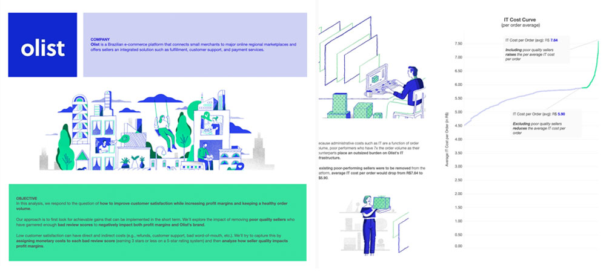

# Introduction
Low customer satisfaction can have direct and indirect costs (e.g., refunds, customer support, bad word-of-mouth, etc.). Especially with online platforms displaying ratings for sellers or products, these negative online reviews can have long-lasting and outsized effects on the bottom line and brand. 

**[Olist](https://olist.com/pt-br/)** is a rapidly growing Brazilian e-commerce platform that connects small merchants to major online regional marketplaces and offers sellers an integrated solution such as fulfillment, customer support, and payment services. 

In this project, I analyze a dataset containing 100k orders from Olist to figure out *how the company can increase customer satisfaction (so as to increase profit margins) while still maintaining a healthy order volume*. This repo contains a collection of Jupyter Notebooks documenting my analysis. 

**Analysis (with Executive Summary)**
- [**Profit Analysis & Recommendations**](https://nbviewer.org/github/phlln/olist-analysis/blob/main/notebooks/Profit%20Analysis%20%26%20Recommendations.ipynb?flush_cache=True) (Jupyter Notebook)

**Presentation & Dashboard**
- [**Presentation**](https://public.tableau.com/app/profile/phil.lin/viz/OlistPoor-performingSellersSTORY/Poor-performersOutsizedImpact) (Tableau)
- [**Dashboard**](https://public.tableau.com/app/profile/phil.lin/viz/OlistPoor-performingSellersDASHBOARD/InteractiveDash) (Tableau)

# Analysis 📊 

***QUESTION:*** *How do we increase customer satisfaction (so as to increase profit margins) while maintaining a healthy order volume?*

I break this question down into 2 parts:

*1. What factors influence customer satisfaction?*

*2. What impact does adjusting those factors have on profits margins and order volume?*

**PART 1**

To understand more clearly what factors influence customer satisfaction (as measured by review scores), I first perform exploratory data analysis using Python and then examine the characteristics of the data, distributions, and correlations. Next, I run linear regression models to identify which features have the largest impact on customer review scores. To corroborate these findings, I re-frame the analysis so that we can also run logistic regression models on the data.

**Detailed Analyses for Part 1:**
- [Orders Data Analysis](https://nbviewer.org/github/phlln/olist-analysis/blob/main/notebooks/Orders%20Data%20Analysis.ipynb?flush_cache=True)
- [Sellers Data Analysis](https://nbviewer.org/github/phlln/olist-analysis/blob/main/notebooks/Sellers%20Data%20Analysis.ipynb?flush_cache=True)

**PART 2**

My approach is to first look for achievable gains that can be implemented in the short term. Given the findings from Part 1, I  explore the impact of removing “poor-quality sellers” who have garnered enough bad review scores to negatively impact both profit margins and Olist’s brand. I conclude with a summary of the findings and my recommendations.

**Detailed Analysis (including an Executive Summary) for Part 2:**

- [Profit Analysis & Recommendations](https://nbviewer.org/github/phlln/olist-analysis/blob/main/notebooks/Profit%20Analysis%20%26%20Recommendations.ipynb?flush_cache=True)

**Data Visualizations (Tableau)**
- [Story](https://public.tableau.com/app/profile/phil.lin/viz/OlistPoor-performingSellersSTORY/Poor-performersOutsizedImpact)
- [Dashboard](https://public.tableau.com/app/profile/phil.lin/viz/OlistPoor-performingSellersDASHBOARD/InteractiveDash)

***Supplementary Notebooks showing Custom Class & Method Implementation:***
- [Olist Class](https://nbviewer.org/github/phlln/olist-analysis/blob/main/notebooks/Olist%20Class%20-%20Method%20Implementation.ipynb?flush_cache=True)
- [Order Class](https://nbviewer.org/github/phlln/olist-analysis/blob/main/notebooks/Order%20Class%20-%20Method%20Implementation.ipynb?flush_cache=True)
- [Seller Class](https://nbviewer.org/github/phlln/olist-analysis/blob/main/notebooks/Seller%20Class%20-%20Method%20Implementation.ipynb?flush_cache=True)

## Requirements
- [Python 3.8.6](https://www.python.org/downloads/release/python-386/)
- [Jupyter Notebook](http://jupyter.org/)

## Dependencies
- [pandas](https://pandas.pydata.org/)
- [numpy](http://www.numpy.org/)
- [seaborn](https://seaborn.pydata.org/) 
- [matplotlib](https://matplotlib.org/)
- [statsmodels](https://www.statsmodels.org/)

## License
- [Attribution-NonCommercial-ShareAlike 4.0 International (CC BY-NC-SA 4.0)](https://creativecommons.org/licenses/by-nc-sa/4.0/)
